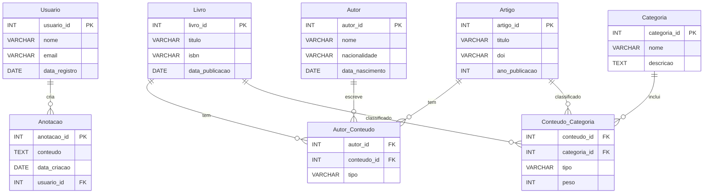

# Biblioteca Digital de Livros e Artigos Científicos

## Integrantes do Grupo

- Sérgio Martins de Oliveira Santos - RA: 22.222.021-2  

## Descrição do Projeto

Este projeto implementa um sistema de gerenciamento para uma biblioteca digital de livros e artigos científicos. Ele permite gerenciar usuários, livros, artigos, categorias, anotações e autores, além de explorar informações úteis por meio de consultas SQL.

## Estrutura do Projeto

O projeto inclui:  
1. **Modelo Entidade-Relacionamento (E-R):** Representa as entidades e relacionamentos do sistema.  
2. **Modelo Relacional:** Normalização das tabelas em 3FN.  
3. **Criação das Tabelas:** Script SQL para criar as tabelas do banco de dados.  
4. **Geração de Dados Aleatórios:** Código em Node.js para gerar dados fictícios e inseri-los no banco de dados.  
5. **Consultas SQL:** 10 consultas úteis para explorar o banco de dados.  

## Tecnologias Utilizadas

- **Banco de Dados:** PostgreSQL  
- **Linguagem:** Node.js  
- **Bibliotecas:** 
  - [`pg`](https://www.npmjs.com/package/pg) para conexão com o PostgreSQL.
  - [`@faker-js/faker`](https://fakerjs.dev/) para gerar dados aleatórios.
  - [`dotenv`](https://www.npmjs.com/package/dotenv) para configurar variáveis de ambiente.

## Configuração do Ambiente

1. **Pré-requisitos:**
   - PostgreSQL instalado.
   - Node.js instalado.

2. **Clonar o repositório:**
   ```bash
   git clone <link-do-repositorio>
   cd biblioteca-digital
   ```

3. **Configurar as variáveis de ambiente:**

Crie um arquivo `.env` na raiz do projeto com o seguinte conteúdo:

   ```env
   PG_HOST=localhost
   PG_PORT=5432
   PG_DATABASE=nome_do_banco
   PG_USER=seu_usuario
   PG_PASSWORD=sua_senha
   ```

4. **Configurar as variáveis de ambiente:**

```bash
  npm install
```
   
5. **Criar as tabelas no banco de dados:**
Execute o script SQL create_tables.sql no seu banco de dados para criar as tabelas.

6. **Gerar e inserir dados aleatórios:**

```bash
  node insertRandomData.js
```

## Modelo de Entidade-Relacionamento


